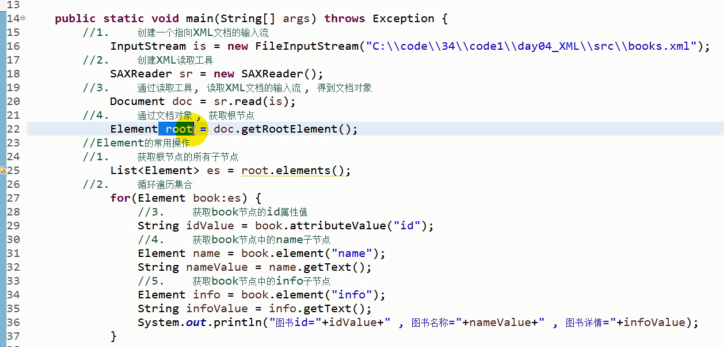

#XML相关知识点
####11/27/2019 11:09:45 AM 
---

###XML简介
	可扩展性标记语言
	特性：
		XML具有平台无关性，是一门独立的编程语言
		XML具有自我描述性
		主要应用于：数据存储，网络数据传输，配置文件
###XML语法
	XML文档通常存储在.xml文件中
	1. xml文档声明
		<?xml version="1.0" encoding="UTF-8"?>
	2. 标记（元素/标签/节点）：用来描述文档
		语法：
			开始标记（开放标签）：   <标记名称>
			结束标记（闭合标签）：	  </标记名称>

			标记名称： 自定义名称，命名规则与java标识符命名规则相同
			标记内容： 开始标记与结束标记之间可以编写标记内容
	3. 标记之间 可以互相嵌套（不允许交叉）
	4. 一个XML文档中，必须有且允许一个根标记
	5. 标记名称允许重复
	6. 标记层级的名称（子标记 父标记 兄弟标记 后代标记 祖先标记）
	7. 标记的属性
		标记中可以包含属性，属性用于描述标记的某些特殊数据
		语法：
			在开始标记中，描述标记的属性
			一个标记可以包含0~n个属性，每个属性就是一个键值对
			键不允许重复，键与值之间使用等号连接，多个键值对之间使用空格分隔。
			属性值，必须被引号引住（单双均可）
	8. 注释的写法
		多行注释：
				注释开始： <!--
				注释结束： -->

###Java解析XML 掌握

####面试题
	
	问：Java中有几种XML解析的方式？分别是什么？有什么样的优缺点？

	答：
		解析方式可以回答两种 或 四种
		
		1. SAX解析
			事件驱动机制的解析方式
			SAX解析，逐行读取XML文件，每当读取到一个节点的开始/结束/内容/属性时，触发事件。
			我们写程序时，可以在这些时间发生时，执行执行的代码，获取相应的内容。
		
			优点：
				在读取大文件时，节省内存
				(因为逐行读取，所以读取下一行数据时，上一行数据就已经被释放了)
			缺点：
				1. 因为是逐行读取，读取时不操作数据，过去就无法操作了。
				2. 因为是事件驱动机制，我们只能得知事件发生。无法感知到发生事件的元素层次，需要程序员自己标记节点层次。
				3. 因为逐行解析，效率相对较低。
				4. SAX解析方式，是只读 解析方式，无法修改XML文档的内容。

		2. DOM解析
			直接将整个文档，加载到内存，在内存中建立文档树模型，然后通过操作文档树，来完成数据的获取和修改。
			优点：
				1. 文档整体被加载到内存中。虽然耗费了内存。但是解析时效率就相对高了很多。
				2. 文档在内存中加载，可以任意的读取、修改、删除。
			缺点：
				无法解析大文件。
			
		3. JDOM解析
			是DOM解析的扩展，与DOM解析的优缺点完全一致
		4. DOM4J解析
			是DOM解析的扩展，与DOM解析的优缺点完全一致

###DOM4J 解析

	步骤：
		1. 引入jar文件（dom4j.jar）
		2. 创建指向XML文档的输入流。
			InputStram is = new FileInputStream("文件地址")；
		3. 创建一个XML读取的工具对象
			SAXReader sr = new SAXReader();
		4. 通过读取工具，读取XML文档的输入流，并得到文档对象
			Document doc = sr.read(is);
		5. 通过文档对象，获取XML文档的根结点对象
			Element root = doc.getRootElement();
####Element 常用方法
	一个Element对象，就表示一个XML文档的节点。
		- 获取节点名称
			string getName();
		- 获取节点内容 
			String getText();
		- 设置节点内容
			String setText();
		- 根据子节点的名称，获取匹配的第一个子节点对象
			Element element("节点名称");
		- 获取所有的子节点
			List<Element> elemets();
		- 获取节点的属性值
			String attributeValue("属性名称");
案例：

####XPATH解析XML(属于dom4j中的解析方式)

	作用：通过路径快速查找一个或一组元素。
	路径表达式：
		1. /  ：  从根节点开始查找
				eg: /name,表示查找根结点name
		2. // ：  从当前节点查找后代元素***
		3. .  ：  查找当前节点
		4. .. ：  查找父节点
		5. @  ：  选择属性

####XPATH如何使用？

	通过Node类的方法，来完成查找
	方法1：
		用于一次查找单个节点
		Node node = node.selectSingleNode("xpath表达式");
	方法2：
		用于一次查找一组节点
		List<Node> nodes = node.selectNodes("xpath表达式");
案例：

		//1.	创建指向XML文件的输入流  
		InputStream is = new FileInputStream("C:\\code\\34\\code1\\day04_XML\\src\\students.xml");
		//2.	创建XML读取工具
		SAXReader sr = new SAXReader();
		//3.	读取XML文件输入流. 并得到文档对象
		Document doc = sr.read(is);
		//4.	使用xpath查找一组name
		List<Element> es = doc.selectNodes("//age");
		for (Element element : es) {
			System.out.println(element.getText());
		}
		//5.	使用xpath查找单个name 
		Element e = (Element)doc.selectSingleNode("//student[@id='2']//name");
		System.out.println(e.getText());

####文件下载

	public static void main(String[] args) throws Exception {
		Scanner input = new Scanner(System.in);
		System.out.println("请输入要下载的资源网址:");
		//https://itdage.cn/file/editplus.exe
		String text = input.nextLine();
		//0:https:  1:  2:itdage.cn  3:file  4:editplus.exe
		String[] split = text.split("/");
		String fileName = split[split.length-1];
		//1.	判断文件名称中是否存在问号?
		if(fileName.contains("?")) {
			int endIndex = fileName.indexOf("?");
			fileName = fileName.substring(0,endIndex);
		}						
		
		//1.	创建Java中的网址对象
		URL url = new URL(text);
		//2.	通过网址对象, 打开链接 , 并得到连接对象
		URLConnection conn = url.openConnection();
		
		//2.1	得到连接资源的总字节数
		int length = conn.getContentLength();
		//3.	通过连接对象 , 连接资源的输入流
		InputStream is = conn.getInputStream();
		//TODO 旧技术
		
		//1.	创建一个文件的输出流
		FileOutputStream fos = new FileOutputStream("c://download/"+fileName);
		//2.	边读边写
		//2.0	准备一个int类型的变量size , 用于存储总读取的字节个数
		int size = 0;
		//2.1	准备一个int类型的变量count ,用于存储每次读取的字节个数
		int count = 0;
		//2.2	准备一个byte[] , 用于存储每次读取的数据.
		byte[] bytes = new byte[1024*10];
		//2.3	循环读取
		while((count=is.read(bytes))!=-1) {
			//2.4	将读取的字节个数, 汇总
			size+=count;
			System.out.println("文件下载中:"+(size/(length/100))+"%     \t已下载字节数:"+size+"\t总字节数:"+length);
			//2.5	将读取的内容(bytes) 写出到文件中
			fos.write(bytes, 0, count);
		}
		fos.close();
		is.close();
		System.out.println("下载完毕");
		
	}

####XML的DOM4J解析(网络文件)

	public static void main(String[] args) throws Exception {
		System.out.println("欢迎使用 号码归属地查询 ");
		System.out.println("请输入要查询的手机号码:");
		Scanner input = new Scanner(System.in);
		String phone = input.nextLine();
		//1.	创建一个网址对象
		URL url = new URL("http://apis.juhe.cn/mobile/get?dtype=xml&key=9f3923e8f87f1ea50ed4ec8c39cc9253&phone="+phone);
		//2.	打开链接, 并得到连接对象
		URLConnection conn = url.openConnection();
		//3.	通过连接对象,  得到文件的输入流
		InputStream is = conn.getInputStream();
		//4.	创建XML读取工具
		SAXReader sr = new SAXReader();
		//5.	读取输入流, 得到文档对象
		Document doc = sr.read(is);
		//6.	得到根节点
		Element root = doc.getRootElement();
		//7.	得到root下的error_code节点
		if("0".equals(root.element("error_code").getText())) {
			//查询成功
			//8.	通过根节点, 得到result子节点
			Element result = root.element("result");
			//9.	获取result下的各个内容:
			String province = result.element("province").getText();
			String city = result.element("city").getText();
			String areacode = result.element("areacode").getText();
			String zip = result.element("zip").getText();
			String company = result.element("company").getText();
			//10.	如果省份和城市一样. 则不显示省份
			System.out.println("查询结果如下:");
			if(!province.equals(city)) {
				System.out.println("省份:"+province);
			}
			System.out.println("城市:"+city);
			System.out.println("区号:"+areacode);
			System.out.println("邮编:"+zip);
			System.out.println("运营商:"+company);
		}else {
			//查询失败
			System.out.println("请输入正确的手机号码");
			
		}
		
	}

####通过JAVA生成XML文档

	步骤：
		1. 通过文档帮助器（DocumentHelper），创建空的文档对象
			Document doc = DocumentHelper.createDocument();
		2. 通过文档对象，添加根节点，并得到新添加的节点对象
			Element root = doc.addElement("根节点名称");
		3. 通过根节点，丰富子节点
			Element 子节点 = root.addElement("元素名称");
		4. 创建一个文件输出流，用于将XML文档输出到文件中
			FileOutputStream fos = ...
		5. 将文件输出流，转换为XML文档输出流
			XMLWriter xw = new XMLWriter(fos);
		6. 写出文档，并释放资源
			xw.write(doc);
			xw.close();
			foc.close();

案例：

	public static void main(String[] args) throws Exception {
		//1.	创建文档对象
		Document doc = DocumentHelper.createDocument();
		//2.	给文档添加根节点
		Element root = doc.addElement("books");
		//3.	通过根节点 丰富子节点
		for(int i=0;i<1000;i++) {
			//给根节点添加book子节点
			Element book = root.addElement("book");
			//给每一个book节点 添加name和info子节点
			Element name = book.addElement("name");
			Element info = book.addElement("info");
			//设置book的id属性
			book.addAttribute("id", 10001+i+"");
			//设置name节点的内容
			name.setText("金苹果"+i);
			//设置info节点的内容
			info.setText("讲述了苹果种植哈哈的过程");
		}
		//4.	创建文件输出流
			FileOutputStream fos = new FileOutputStream("c:\\books2.xml");
		//5.	将流转换为XML文档输出流
			XMLWriter xw = new XMLWriter(fos);
		//6.	写出文档 , 并释放资源
			xw.write(doc);
			xw.close();
			fos.close();
			System.out.println("文件生成完毕");
		
	}

###给元素添加子节点
	Element 子节点 = 元素对象.addElement("元素名称");
###给元素添加属性和值
	元素对象.addAttribute(String 属性名,String 属性值)；
		