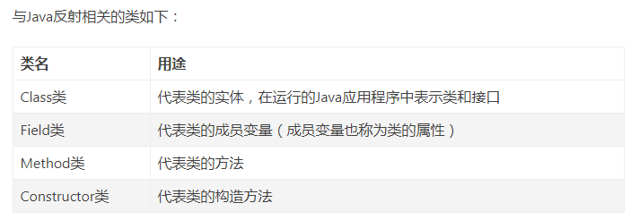
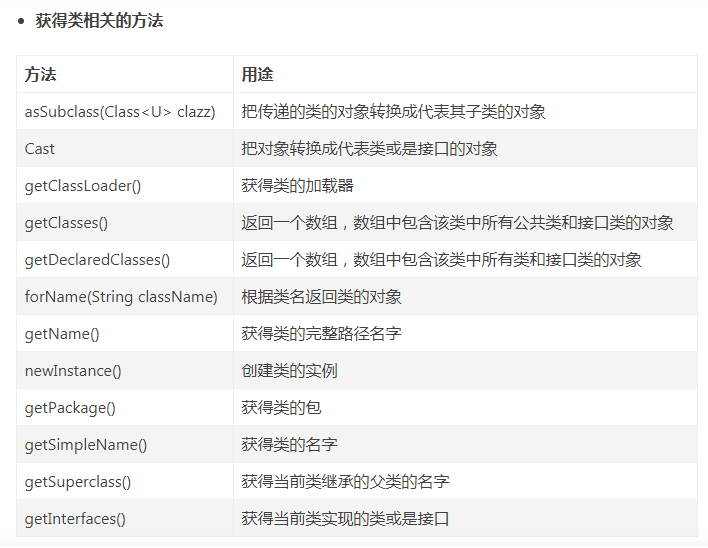
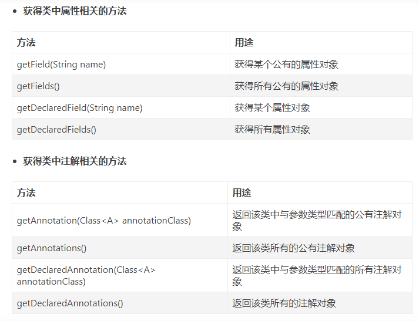
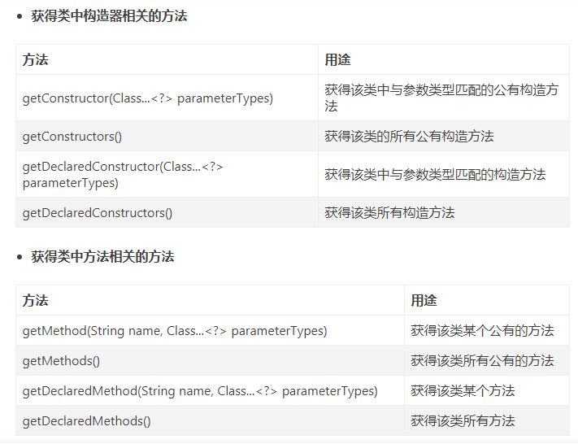
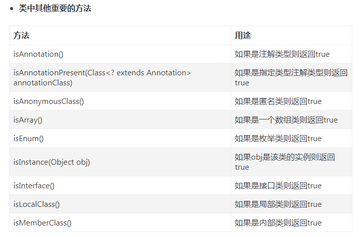
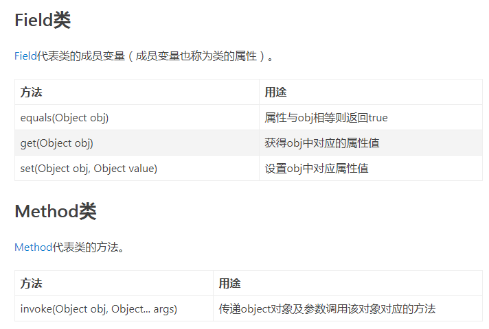
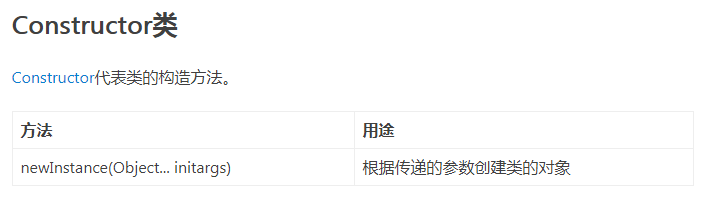

#反射机制

11/27/2019 3:49:11 PM 
***

###基本概念
    通常情况下编写代码都是固定的，无论运行多少次执行的结果也是固定的，在某些特殊情况中编写代码是不确定要创建什么类型的对象，也不确定要调用什么样的方法，这些都希望通过运行时传递的参数来决定，改机制叫做动态编程机制。也就是反射机制
	反射机制就是用来动态创建对象并且动态调用方法的机制
	目前主流的框架底层都是采用反射机制实现的。

###Class类
1. 基本概念
	java.lang.Class类的实例用于描述Java应用程序中的类和接口，也就是一种数据类型。该类没有公共构造方法，该类的实例由Java虚拟机和类加载器自动构造完成。
2. 获取Class对象的方式
	a.使用数据类型.class的方式可以获取对应类型的Class对象
	b.使用引用/对象.getClass()的方式可以获取对应类型的Class对象

3. 常用的方法
	static Class<?> forName(String className)
		- 用于获取参数指定类型对应的Class对象并返回 
	T newInstance()
		- 用于创建该Class对象所表示类的新实例
		- 若该Class对象代表Person类，则调用该方法的意义就是创建Person类型的对象
		- 若该Class对象代表String类，则调用改方法的意义就是创建String类型的对象
	Constructor<T> getConstructor(Class<?>... parameterTypes)
		- 用于获取此Class对象所表示的类型中参数指定的公共构造方法。
		- 若该Class对象代表Person类，则调用改方法的意义就是获取Person类中的公共构造方法，具体哪个构造方法由参数决定。
	Constructor<?>[] getConstructors()
		- 用于获取此Class对象所表示类型中所有的公共构造方法。
	Field getDeclaredField(String name)
		- 用于获取此Class对象所表示类型中所有的公共构造方法。
		- 若该Class对象代表Person类，则调用该方法的意义就是获取Person类中成员变量，具体哪个成员变量由参数决定。
	Field[] getDeclaredField()
		- 用于获取此Class对象所表示类中所有成员变量的信息。

###Constructor类  
1. 基本概念
	java.lang.reflect.Constructor类主要用于描述获取到的构造方法信息。
2. 常用的方法
	 T newInstance(Object... initargs)  
		- 使用此Constructor对象描述的构造方法来构造Class对象代表类型的新实例。
		- 该方法的参数用于给新实例中的成员进行初始化操作。
		- 若该Constructor对象代表Person类中的有参构造方法，则调用该方法的意义就是使用有参构造方法。

###Field类
1. 基本概念
	 java.lang.reflect.Field类主要用于描述获取到的单个变量信息。
2. 常用的方法
	Object get(Object obj)
		- 调用该方法的意义就是获取参数对象obj此Filed对象所表示成员变量的数值。
		- 若该Field对象代表Person类中的成员变量name,name调用该方法就是获取对象obj成员变量name的数值。
	void set(Object obj,Object value)
		- 将参数对象obj中此Field对象表示成员变量的数值修改为参数value的数值。
		- 若该Field对象代表Person类中成员变量name，那么调用该方法就是将对象obj中成员变量name的数值修改为value的数值。
	
	void setAccessible(boolean flag) 设置私有属性可见性   

	Method getMethod(String name,Class<?>... parameterTypes)    
		- 用于获取该Class对象表示类型中名字为name参数parameterTypes的指定公共成员方法   
		- 若该Class对象表示为Person类型，则调用该方法的意义就是获取Person类中的成员方法  
	Method[] getMethods()    
		- 用于获取该Class对象表示类中所有的公共成员方法   
###Method类
1. 基本概念
	java.lang.reflect.Method类主要用于描述获取到的单个成员方法信息
2. 常用的方法   
    Object invoke(Object obj,Obejct... args)   
		- 使用对象obj来调用此Method对象所表示的成员方法，实参传递args.   
		- 若此Method对象代表Person类中的getName方法，则调用该方法的意义就是使用对象obj来调用getName方法，实参传递args。
***

##[反射机制相关类](https://www.jianshu.com/p/9be58ee20dee)		

 

