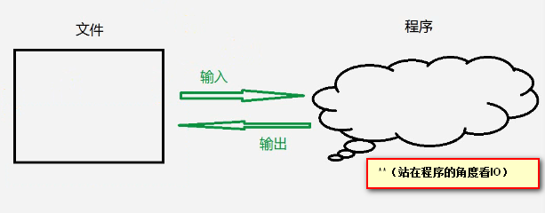
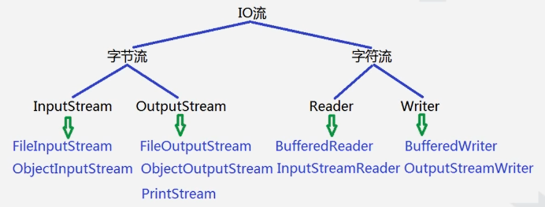

##IO流
**12/3/2019 10:45:47 AM**

1. 基本概念  
	* I/O就是Input/Output的简写，也就是输入/输出的含义。
	* I/O流就是指读写数据时像流水一样不间断，因此得名为“流”。
2. 基本分类
	
	根据数据读写的单位不同分为：字节流和字符流
	* 字节流：以字节为单位进行读写的流，可以读取任意类型的文件。
	* 字符流：已字符（2个字节）为单位进行读写的流，只能读写文本文件。

	根据数据流动的方向不同分为：输入流和输出流（站在程序的角度）
	* 输入流：将数据从文件中输入到程序中，也就是读取文件中的内容。
	* 输出流：将数据从程序输出到文件中，也就是写入到文件中。
	
	 

	节点流和包装流

3. File类（java34--day16--choose）
* 基本概念
	java.io.File类主要用于描述文件和目录的路径信息，可以获取名称、大小等属性信息。
* 常用方法（查看API中的对应方法）  
	绝对路径 - 主要指以根目录开始的路径信息，如：c:/...等
	相对路径 - 主要指以当前工作目录开始的路径信息，如./..
			- . 表示当前目录   ..表示当前目录的上一级目录
			- 在以后的开发中尽量使用相对路径。

4. IO流的框架结构
	
	

***1..FileOutputStream***
***
* 基本概念  
	java.io.FileOutputStream类主要用于将图像数据之类的原始字节流写入到输出流中。
* 常用方法  
	* void close() - 关闭此文件输出流并释放与此流有关的所有系统资源。
	* void write(byte[] b) - 将 b.length 个字节从指定 byte 数组写入此文件输出流中。
	* void write(byte[] b, int off, int len) - 将指定 byte 数组中从偏移量 off 开始的 len 个字节写入此文件输出流。 
	* void write(int b) - 将指定字节写入此文件输出流。   

	相关代码：

		try {
			// 1.构造FileOutputStream类型的对象与c:/a.txt文件关联
			// 若文件不存在，该流会自动创建新的空文件
			// 若文件存在，该流会自动清空文件中的原有内容
			FileOutputStream fos = new FileOutputStream("c:/a.txt");
			// 若文件存在，则将新数据写入到文件的末尾，保留原有内容
			//FileOutputStream fos = new FileOutputStream("c:/a.txt", true);
			// 2.向输出流中写入数据内容
			fos.write(97);    // 'a'
			fos.write('9');   // '9'  跟在a的后面
			fos.write('7');   // '7'
			fos.write("hello".getBytes()); // hello
			System.out.println("写入数据成功！");
			
			// 3.关闭流对象并释放有关的资源
			fos.close();
		} catch(Exception e) {
			e.printStackTrace();
		}
		

***2..FileInputStream***
***
* 基本概念  
	java.io.FileInputStream类主要用于从输入流中读取图像数据之类的原始字节流。
* 常用方法

	* int available() -  获取文件的大小
	* void close() -  关闭此文件输入流并释放与此流有关的所有系统资源。 
	* int read() - 从此输入流中读取一个数据字节。 
	* int read(byte[] b) - 从此输入流中将最多 b.length 个字节的数据读入一个 byte 数组中。 
	* int read(byte[] b, int off, int len) - 从此输入流中将最多 len 个字节的数据读入一个 byte 数组中。 

	相关代码：

		try {
			// 1.创建FileInputStream类型的对象与c:/a.txt文件关联
			FileInputStream fis = new FileInputStream("c:/a.txt");
			
			// 2.从输入流中读取数据内容并打印出来
			/*
			int res = fis.read();
			System.out.println("读取到的单个字节是：" + res 
				+ "，对应的字符是：" + (char)res); // 97 'a'
			*/
			// 使用while循环将文件中的所有内容读取出来
			/*
			int res = 0;
			while((res = fis.read()) != -1) {
				System.out.println("读取到的单个字节是：" + res 
					+ "，对应的字符是：" + (char)res); 
			}
			*/
			// 读满数组中的一部分空间
			byte[] bArr = new byte[20];
			// 表示从输入流中读取10个字节的数据存放到数组bArr中下标从5开始的位置
			int res = fis.read(bArr, 5, 10);
			System.out.println("实际读取到的数据大小是：" + res 
				+ "，读取到的数据内容是：" + new String(bArr) + "!");
			
			// 3.关闭流对象并释放有关的资源
			fis.close();
		} catch(Exception e) {
			e.printStackTrace();
		}

**文件拷贝案例代码：实现了大文件的拷贝（例如视频的拷贝）**

	try {
			// 1.构造FileInputStream类型的对象与c:/a.txt文件关联  重中之重
			FileInputStream fis = new FileInputStream("D:\\java34\\day16\\must\\video/1 作业讲解之HashSet集合中生成随机数.wmv");
			// 2.构造FileOutputStream类型的对象与c:/b.txt文件关联
			FileOutputStream fos = new FileOutputStream("c:/1 作业讲解之HashSet集合中生成随机数.wmv");
			
			// 3.不断地从输入流中读取数据内容并写入到输出流中
			System.out.println("正在玩命地拷贝...");
			// 方式一：以单个字节为单位进行文件的拷贝
			// 缺点：当文件稍大时，则拷贝文件的效率极低
			/*
			int res = 0;
			while((res = fis.read()) != -1) {
				fos.write(res);
			}
			*/
			// 方式二：准备一个和文件大小一样的缓冲区，一次性读满再一次性写完
			// 缺点：当文件过大时，无法申请和文件大小一样的缓冲区  真实物理内存不足
			/*
			int len = fis.available();
			System.out.println("获取到的文件大小是：" + len);
			byte[] bArr = new byte[len];
			// 一次性将输入流关联文件的所有内容读取出来
			int res = fis.read(bArr);
			System.out.println("实际读取到的文件大小是：" + res);
			// 一次性将所有内容写入到输出流中
			fos.write(bArr);
			*/
			// 方式三：准备一个合适的缓冲区，每次将缓冲区读满，但读很多次
			// 在以后的开发中推荐该方式
			byte[] bArr = new byte[1024*8];   
			int res = 0; 
			while((res = fis.read(bArr)) != -1) {
				fos.write(bArr, 0, res);
			}
			System.out.println("拷贝文件成功！");
			
			// 4.关闭流对象并释放有关的资源
			fos.close();
			fis.close();
		} catch(Exception e) {
			e.printStackTrace();
		}    

***3..PrintStream***
***
* 基本概念  
	java.io.PrintStream类主要用于方便地打印各种数据内容并且自动刷新。
* 常用方法  
	* PrintStream(OutputStream out) - 根据参数指定的引用来构造对象。其中OutputStream类是个抽象类，实参需要传递子类的对象。
	* void print(String s) - 用于将参数指定的字符串内容打印出来。
	* void println(String s) - 用于打印字符串后终止该行。
	* void close() - 用于关闭文件输出流并释放有关的资源。

相关代码：  
	
	//1.构造PrintStream类型的对象与c:/a.txt文件关联
	PrintStream ps = new PrintStream(new FileOutputStream("c:/a.txt"));
	//向输入流中写入数据内容
	ps.print("hello"); //单纯的写入字符串
	//当前系统中对应的行终止符为\r(13),\n(10)
	ps.println("hello"); //写入字符串后终止该行，也就是换行
	System.out.println("写入数据成功！");
	//3.关闭流对象并释放有关的资源
	ps.close();

***4..BufferedReader***
***
* 基本概念  
	java.io.BufferedReader类主要用于读取单个字符，字符数组以及一行字符串。
* 常用方法	
	* BufferedReader(Reader in) - 根据参数指定的引用来构造对象。其中Reader类是个抽象类，实参需要传递子类对象。
	* String readLine() - 用于读取一行字符串并返回。
	* void close() - 用于关闭文件输出流并释放有关的资源。
	* int read() - 读取单个字符。

相关代码：

	//1.构造BufferReader类型的对象与c:/a.txt文件关联
	BufferedReader bf = new BufferedReader(new InputStreamReader(new FileInputStream("c:/a.txt")));
	//2.从输入流中读取数据内容并打印出来
	/*int res = 0;
	//读取单个字符
	while((res = br.read() != -1){
		System.out.println("读取到的字符是："+(char)res+",对应的ASCII是："+res);
	}*/
	//从输入流中读取一行字符串，遇到行终止符读取停止
	String str = br.readLine();
	System.out.println("读取到的字符是："+str);
	//3.关闭流对象
	ps.close();

***5..BufferedWriter***
***
* 基本概念 
	java.io.BufferedWriter类主要用于向字符输出流中写入单个字符、字符数组以及字符串。
* 常用方法
	* BufferedWriter(Writer out) -  根据参数指定的引用来构造对象。其中Writer类是个抽象类，实参需要传递子类对象。
	* void write(int c) - 写入单个字符 
	* void write(char[] cbuf, int off, int len) - 写入字符数组的某一部分。 
	* void write(String s, int off, int len) - 写入字符串的某一部分。 
	* void newLine() - 写入一个行分隔符。
	

***6..ObjectOutPutStream***
***
* 基本概念 
	java.io.ObjectOutPutStream类主要用于将Java语言中的对象整体写入到输入流中。
	>只能将支持java.io.Serializable接口的对象写入流中，也就是说被写入对象的数据类型必须实现该接口。
	>>类通过实现java.io.Serializable接口以启用其序列化功能。
	>>>所谓序列化主要指讲一个对象需要保存的所有相关信息有效组织成字节序列的转化过程。
* 常用方法
	* ObjectOutPutStream(OutPutStream out) - 根据参数指定引用来构造对象，其中OutPutStream类是个抽象类，因此实参需要传递子类对象。
	* void writeObject(Object obj) - 用于将参数指定的对象整体写入到输出流中。
	* void close - 用于关闭文件输出流并释放相关的资源。

***7..ObjectInPutStream***
***
* 基本概念 
	java.io.ObjectInPutStream类主要用于从输入流中将一个对象整体读取出来（反序列化）
* 常用方法
	*  ObjectInPutStream(InPutStream in) - 根据参数指定的引用来构造对象，其中InPutStream类是个抽象类，实参需要传递子类的对象。
	*  Object readObject() - 主要用于从输入流中读取一个对象并返回，无法通过返回值来判断是否读取到文件的末尾。
	*  void close() - 用于关闭文件输出流并释放有关资源。

***
>>>当需要向文件中写入多个对象时，可以先将多个对象放入一个集合中，然后将集合这个整体看做一个对象调用一个writeObject方法整体写入文件，此时只要调用一次readObject方法就可以将整个集合读取出来。

***8..DataOutPutStream***
***
* 基本概念 
	java.io.DataOutPutStream类主要用于以适当的方式将基本数据类型写入到输出流中。
* 常用的方法
	* DataOutPutStream(OutPutStream out) - 根据参数指定的引用构造对象。其中OutPutStream类是个抽象类，实参需要传递子类的对象。
	* void writeInt(int v) - 用于将参数指定的整数一次性写入输出流，优先使用高字节。一次性写4个字节
						   - 200: 0000 0000 0000 0000 0000 0000 1100 10000
						   			高				=>				低
	* void write(int v) - 一次写入一个字节，写入低字节。

***9..DataInPutStream***
***
* 基本概念 
	java.io.DataInPutStream类主要用于从输入流中读取基本数据类型的数据。
* 常用的方法
	* DataInPutStream(InPutStream in) - 根据参数指定的引用来构造对象。其中InPutStream类是个抽象类，实参需要传递子类的对象。
	* int readInt() - 用于从输入流中一次性读取一个整数数据并返回。一次性读取4个字节。
	* int read() - 一次性读一个字节
	

#####transient关键字
使用transient关键字修饰成员变量表示该成员变量不参与序列化操作。