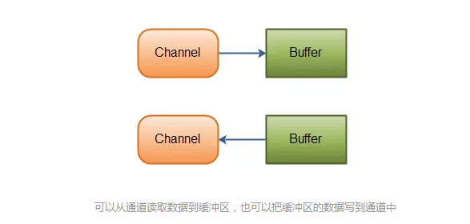
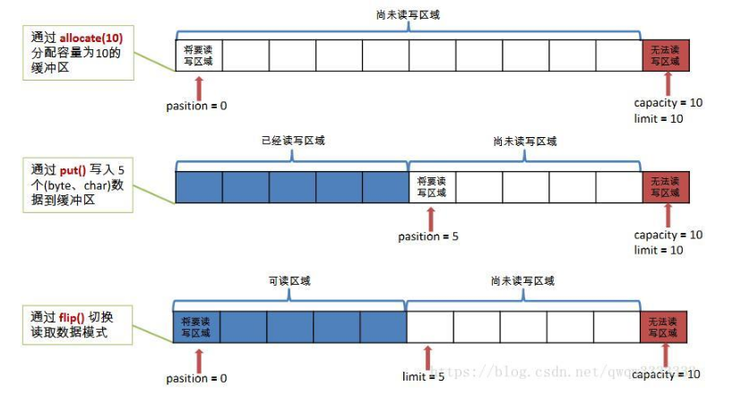

##NIO
**12/3/2019 7:12:57 PM** 

###简介
* java.nio全称java non-blocking IO（实际上是 new io），是指JDK 1.4 及以上版本里提供的新api（New IO） ，为所有的原始类型（boolean类型除外）提供缓存支持的数据容器，使用它可以提供非阻塞式的高伸缩性网络。

###IO和NIO的区别
* 原有的IO是面向流的、阻塞的，NIO则是面向块的、非阻塞的。
* 怎样理解IO是面向流的、阻塞的？   
	* 原始的IO是面向流，不存在缓存的概念。
	* Java IO面向流意味着每次从流中读取一个或多个字节，直到读取所有字节，它们没有被缓存在任何地方。它不能前后移动流中的数据。如果需要前后移动从流中读取数据，需要先将它缓存到一个缓存区。
	* Java IO的各种流是阻塞的，当一个线程调用一个read和write方法时，该线程被阻塞，直到有些数据被读取，或数据完全写入，该线程在此期间不能再干任何事情了。  

* 怎么理解NIO是面向块的、非阻塞的?
	* NIO是面向缓冲区的。数据读取到一个它稍后处理的缓冲区，需要时可在缓冲区中前后移动，这就增加了处理过程中的灵活性。
	* Java NIO的非阻塞模式，使一个线程从某通道发送请求读取数据，但是它仅能得到目前可用的数据，如果目前没有数据可用时，就什么都不会获取，而不是保持线程阻塞，所以直至数据变的可以读取之前，该线程可以继续做其他的事情。 非阻塞也是如此，一个线程请求写入一些数据到某通道，但不需要等待它完全写入，这个线程同时可以去做别的事情。
	>通俗理解：NIO是可以做到用一个线程来处理多个操作的。假设有10000个请求过来,根据实际情况，可以分配50或者100个线程来处理。不像之前的阻塞IO那样，非得分配10000个。

##**NIO的核心实现**
**在标准IO API中，你可以操作字节流和字符流，但在新IO中，你可以操作通道和缓冲，数据总是从通道被读取到缓冲中或者从缓冲写入到通道中。**

* 核心API： Channel, Buffer, Selector  

	1. 通道Channel  
		* Channel的实现类
			* FileChannel：用于读取、写入、映射和操作文件的通道。（用于本地文件操作）
			* DatagramChannel：通过UDP 读写网络中的数据通道。
			* SocketChannel：通过TCP 读写网络中的数据。
			* ServerSocketChannel：可以监听新进来的TCP 连接，对每一个新进来的连接都会创建一个SocketChannel。   

		NIO的通道类似于流，但有些区别如下：
		* 通道可以同时进行读写，而流只能读或者只能写
		* 通道可以实现异步读写数据
		* 通道可以从缓冲读数据，也可以写数据到缓冲: 
		

	2. 缓存Buffer（ByteBuffer、CharBuffer、ShortBuffer、IntBuffer、LongBuffer、FloatBuffer、DoubleBuffer）

		缓冲区本质上是一个可以写入数据的内存块，然后可以再次读取，该对象提供了一组方法，可以更轻松地使用内存块，使用缓冲区读取和写入数据通常遵循以下四个步骤：  
		* 写数据到缓冲区；
		* 调用buffer.flip()方法；
		* 从缓冲区中读取数据；
		* 调用buffer.clear()或buffer.compat()方法；  
		  
		当向buffer写入数据时，buffer会记录下写了多少数据，一旦要读取数据，需要通过flip()方法将Buffer从写模式切换到读模式，在读模式下可以读取之前写入到buffer的所有数据，一旦读完了所有的数据，就需要清空缓冲区，让它可以再次被写入。

	3. Buffer在与Channel交互时，需要一些标志:  
		1. Capacity - buffer的大小/容量(作为一个内存块，Buffer有一个固定的大小值，用参数capacity表示)
		2. Position​ - 当前读/写的位置(当写数据到缓冲时，position表示当前待写入的位置，position最大可为capacity – 1；当从缓冲读取数据时，position表示从当前位置读取)
		3. limit - 信息末尾的位置(在写模式下，缓冲区的limit表示你最多能往Buffer里写多少数据； 写模式下，limit等于Buffer的capacity，意味着你还能从缓冲区获取多少数据)
		4. mark - 标记，表示记录当前 position 的位置。可以通过 reset() 恢复到 mark 的位置
		
		
 	0 <= mark <= position <= limit <= capacity
	
	
* 缓冲区常用的操作
	* 直接缓冲区和非直接缓冲区的区别：
		* 非直接缓冲区：通过allocate()方法分配缓冲区，将缓冲区建立在JVM的内存中。
		* 直接缓冲区：通过 allocateDirect() 方法分配直接缓冲区，将缓冲区建立在物理内存中。可以提高效率
			* 占内存 不安全。数据写入物理内存缓冲区中，程序就丧失了对这些数据的管理，即什么时候这些数据被最终写入从磁盘只能由操作系统来决定，应用程序无法再干涉。但是效率高
	* 向缓存区写数据
		1. 从Channel写到Buffer；
		2. 通过Buffer的put方法写到Buffer中；
	* 从缓冲区读取数据：
		1. 从Buffer中读取数据到Channel；
		2. 通过Buffer的get方法从Buffer中读取数据；
	* Buffer的常用方法：
		1. Buffer clear()	清空缓冲区并返回对缓冲区的引用
		2. Buffer flip()	将缓冲区的界限设置为当前位置，并将当前位置充值为0
		3. int capacity()	返回Buffer的capacity大小
		4. boolean hasRemaining()	判断缓冲区中是否还有元素
		5. int limit()	返回Buffer 的界限(limit) 的位置
		6. Buffer limit(int n)	将设置缓冲区界限为n, 并返回一个具有新limit 的缓冲区对象
		7. Buffer mark()	对缓冲区设置标记
		8. int position()	返回缓冲区的当前位置position
		9. Buffer position(int n)	将设置缓冲区的当前位置为n , 并返回修改后Buffer 对象
		10. int remaining()	返回position 和limit 之间的元素个数
		11. Buffer reset()	将位置position 转到以前设置的mark 所在的位置
		11. Buffer rewind()	 将位置设为为0，取消设置的mark
		
	* flip方法：将Buffer从写模式切换到读模式，将position值重置为0，limit的值设置为之前position的值；
	* clear方法和compact方法的区别：
		* 调用clear()方法：position将被设回0，limit设置成capacity，换句话说，Buffer被清空了，其实Buffer中的数据并未被清除，只是这些标记告诉我们可以从哪里开始往Buffer里写数据。如果Buffer中有一些未读的数据，调用clear()方法，数据将“被遗忘”，意味着不再有任何标记会告诉你哪些数据被读过，哪些还没有。
		* 如果Buffer中仍有未读的数据，且后续还需要这些数据，但是此时想要先写些数据，那么使用compact()方法。compact()方法将所有未读的数据拷贝到Buffer起始处。然后将position设到最后一个未读元素正后面。limit属性依然像clear()方法一样，设置成capacity。现在Buffer准备好写数据了，但是不会覆盖未读的数据。
	* Selector
		1. 一个组件，可以检测多个NIO channel，看看读或者写事件是否就绪。
		2. 多个Channel以事件的方式可以注册到同一个Selector，从而达到用一个线程处理多个请求成为可能。

>>>所有数据都通过 Buffer 对象来处理。您永远不会将字节直接写入通道中，相反，您是将数据写入包含一个或者多个字节的缓冲区。同样，您不会直接从通道中读取字节，而是将数据从通道读入缓冲区，再从缓冲区获取这个字节。

