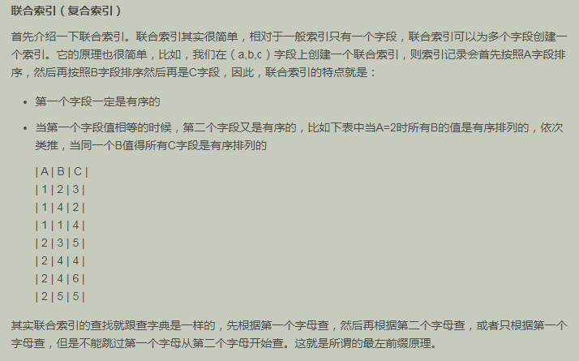
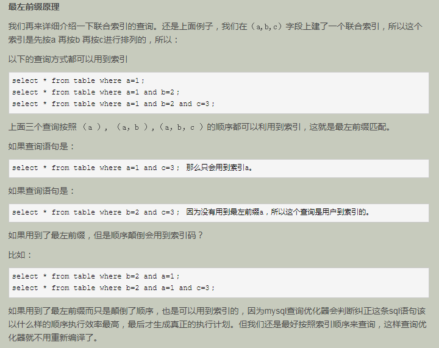
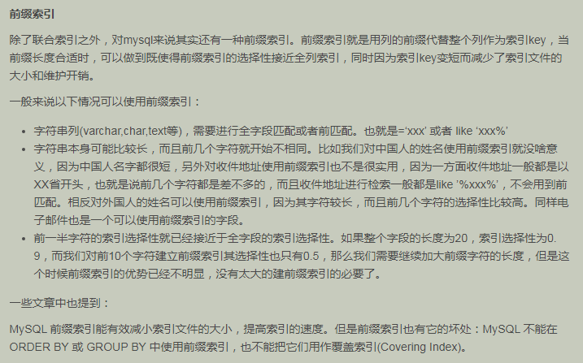

##了解数据库索引采用B+树数据结构优化查询原理
###局部性原理和磁盘预读
* 由于存储介质的特性，磁盘本身存取就比主存慢很多，再加上机械运动耗费，磁盘的存取速度往往是主存的几百分分之一，因此为了提高效率，要尽量减少磁盘I/O。为了达到这个目的，磁盘往往不是严格按需读取，而是每次都会预读，即使只需要一个字节，磁盘也会从这个位置开始，顺序向后读取一定长度的数据放入内存。这样做的理论依据是计算机科学中著名的局部性原理：当一个数据被用到时，其附近的数据也通常会马上被使用。程序运行期间所需要的数据通常比较集中。
* 由于磁盘顺序读取的效率很高（不需要寻道时间，只需很少的旋转时间），因此对于具有局部性的程序来说，预读可以提高I/O效率。预读的长度一般为页（page）的整倍数。页是计算机管理存储器的逻辑块，硬件及操作系统往往将主存和磁盘存储区分割为连续的大小相等的块，每个存储块称为一页（在许多操作系统中，页得大小通常为4k），主存和磁盘以页为单位交换数据。当程序要读取的数据不在主存中时，会触发一个缺页异常，此时系统会向磁盘发出读盘信号，磁盘会找到数据的起始位置并向后连续读取一页或几页载入内存中，然后异常返回，程序继续运行。
###数据库索引原理及优化——数据库索引所采用的数据结构B-/+Tree及其性能分析
* B-树的性能分析
 1. 根据B-Tree的定义，可知检索一次最多需要访问h-1个节点（根节点常驻内存）。数据库系统的设计者巧妙利用了磁盘预读原理，将一个节点的大小设为等于一个页，这样每个节点只需要一次I/O就可以完全载入。为了达到这个目的，在实际实现B-Tree还需要使用如下技巧：每次新建节点时，直接申请一个页的空间，这样就保证一个节点物理上也存储在一个页里，加之计算机存储分配都是按页对齐的，就实现了一个node只需一次I/O。
 2. B-Tree中一次检索最多需要h-1次I/O（根节点常驻内存），渐进复杂度为O(h)=O(logdN)。一般实际应用中，出度d是非常大的数字，通常超过100，因此h非常小（通常不超过3）。
 3. 综上所述，如果我们采用B-Tree存储结构，搜索时I/O次数一般不会超过3次，所以用B-Tree作为索引结构效率是非常高的。
* B+树的性能分析  
 B树的搜索复杂度为O(h)=O(logdN)，所以树的出度d越大，深度h就越小，I/O的次数就越少。B+Tree恰恰可以增加出度d的宽度，因为每个节点大小为一个页大小，所以出度的上限取决于节点内key和data的大小：
	* dmax=floor(pagesize/(keysize+datasize+pointsize))//floor表示向下取整

    由于B+Tree内节点去掉了data域，因此可以拥有更大的出度，从而拥有更好的性能。

* B+树的查找过程
.png)
	将磁盘加载到内存中时，内存中做了二分查找
>>三层的B+树可以表示上百万层的数据，如果上百万的数据查找只需要三次IO，性能提高将是巨大的，如果没有索引，每个数据项都要发生一次IO，那么总共需要百万次的IO，显然成本非常非常高。

###MySQL索引实现
1. MyISAM索引实现
	* MyISAM引擎使用B+Tree作为索引结构，叶节点的data域存放的是数据记录的地址。
	* MyISAM中索引检索的算法为首先按照B+Tree搜索算法搜索索引，如果指定的Key存在，则取出其data域的值，然后以data域的值为地址，读取相应数据记录。MyISAM的索引方式也叫做“非聚集”的，之所以这么称呼是为了与InnoDB的聚集索引区分。
2. InnoDB索引实现
	* InnoDB也使用B+Tree作为索引结构，但具体实现方式却与MyISAM截然不同。
	* 区别：
	  1. InnoDB的数据文件本身就是索引文件，MyISAM索引文件和数据文件是分离的，索引文件仅保存数据记录的地址。
	  2. 在InnoDB中，表数据文件本身就是按B+Tree组织的一个索引结构，这棵树的叶节点data域保存了完整的数据记录。这个索引的key是数据表的主键，因此InnoDB表数据文件本身就是主索引。
	* [参考文件](https://www.cnblogs.com/flysheet/articles/database-index-realize.html)

###数据库索引原理及优化——索引使用策略及优化
	MySQL的优化主要分为结构优化（Scheme optimization）和查询优化（Query optimization）。
1. 联合索引及最左前缀原理

  
2. 索引优化策略

 * 最左前缀匹配原则
 * 主键外检一定要建索引
 * 对 where,on,group by,order by 中出现的列使用索引
 * 尽量选择区分度高的列作为索引,区分度的公式是count(distinct col)/count(*)，表示字段不重复的比例，比例越大我们扫描的记录数越少，唯一键的区分度是1，而一些状态、性别字段可能在大数据面前区分度就是0
 * 对较小的数据列使用索引,这样会使索引文件更小,同时内存中也可以装载更多的索引键
 * 索引列不能参与计算，保持列“干净”，比如from_unixtime(create_time) = ’2014-05-29’就不能使用到索引，原因很简单，b+树中存的都是数据表中的字段值，但进行检索时，需要把所有元素都应用函数才能比较，显然成本太大。所以语句应该写成create_time = unix_timestamp(’2014-05-29’);
 * 为较长的字符串使用前缀索引
 * 尽量的扩展索引，不要新建索引。比如表中已经有a的索引，现在要加(a,b)的索引，那么只需要修改原来的索引即可
 * 不要过多创建索引, 权衡索引个数与DML之间关系，DML也就是插入、删除数据操作。这里需要权衡一个问题，建立索引的目的是为了提高查询效率的，但建立的索引过多，会影响插入、删除数据的速度，因为我们修改的表数据，索引也需要进行调整重建
 * 对于like查询，”%”不要放在前面。  
	SELECT * FROM a WHERE name LIKE'后盾%' -- 走索引
	SELECT * FROM a WHERE nameLIKE "%后盾%" -- 不走索引
 * 查询where条件数据类型不匹配也无法使用索引，字符串与数字比较不使用索引;    
	CREATE TABLEa(achar(10));  
	EXPLAIN SELECT * FROM a WHEREa="1" – 走索引  
	EXPLAIN SELECT * FROM a WHERE a=1 – 不走索引  
   正则表达式不使用索引,这应该很好理解,所以为什么在SQL中很难看到regexp关键字的原因

>>>MYSQL中一行最大存65535个字节(64k)  
>>一页最大存16384个字节(16K)  
  
* Dynamic和Compressed行格式 [(参考资料)](https://www.cnblogs.com/wade-luffy/p/6289183.html) 
* MySQL查询优化之索引条件下推 [(参考资料)](https://blog.csdn.net/qq_41080850/article/details/85254922)  
* [(MySQL Explain 详解)](https://www.cnblogs.com/tufujie/p/9413852.html)  
* [(覆盖索引	)](https://www.cnblogs.com/happyflyingpig/p/7662881.html) 
* 待扩展
