###树
	定义:树（Tree）是n（n>=0)个结点的有限集。n=0时称为空树。在任意一颗非空树中：
			1）有且仅有一个特定的称为根（Root）的结点；
			2）当n>1时，其余结点可分为m(m>0)个互不相交的有限集T1、T2、......、Tn，其中每一个集合本身又是一棵树，并且称为根的子树。

		此外，树的定义还需要强调以下两点：
			1）n>0时根结点是唯一的，不可能存在多个根结点，数据结构中的树只能有一个根结点。
			2）m>0时，子树的个数没有限制，但它们一定是互不相交的。
		由树的定义可以看出，树的定义使用了递归的方式。
#####递归：无限调用自身这个函数，每次调用总会改动一个关键变量，直到这个关键变量达到边界的时候，不再调用,案例如下：
    int factorial(int x,int ans)
	{
   		if(x==1)
       		return  ans;
    	factorial(x-1,ans*x);
	}	

	结点的度：结点拥有的子树数目成为结点的度
	结点层次：从根开始定义起，根为第一层，根的孩子为第二层，以此类推，如下图所示
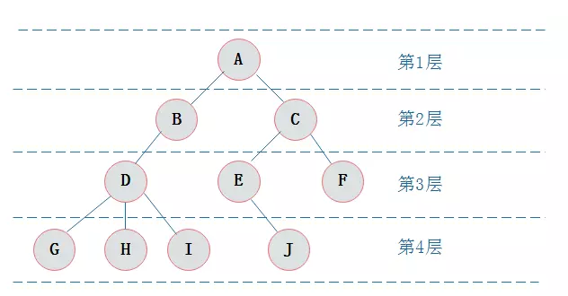

	树的深度：树中节点的最大层次树称为树的深度(从上往下)或高度(从下往上)
##基于java实现一个二叉树结构，显示增删改查的方法
###1. 二叉树的概念和结构
#####1.什么二叉树？
* 二叉树（Binary Tree）二叉树主要指每个节点最多只有两个子节点的树形结构。
* 二叉树的性质：
  1. 在二叉树的第i层上最多有2(i-1) 个节点 。（i>=1）；
  2. 二叉树中如果深度为k,那么最多有2k-1个节点。(k>=1）；
  3. n0=n2+1 n0表示度数为0的节点数，n2表示度数为2的节点数；
  4. 在完全二叉树中，具有n个节点的完全二叉树的深度为[log2n]+1，其中[log2n]是向下取整。
  5. 若对含 n 个结点的完全二叉树从上到下且从左至右进行 1 至 n 的编号，则对完全二叉树中任意一个编号为 i 的结点有如下特性：
		1. 若 i=1，则该结点是二叉树的根，无双亲, 否则，编号为 [i/2] 的结点为其双亲结点;
  		2. 若 2i>n，则该结点无左孩子， 否则，编号为 2i 的结点为其左孩子结点；
  		3. 若 2i+1>n，则该结点无右孩子结点， 否则，编号为2i+1 的结点为其右孩子结点。
* 二叉树结点主要有以下几种：
   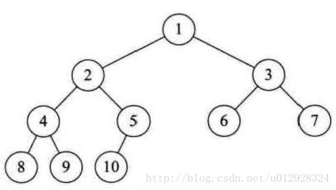
   * 根节点 ：第一层结点,如图1
   * 叶子结点：度为0的结点，如图6,7,8,9,10
   * 分支结点：度不为0的结点，如图1,2,3,4,5
   * 孩子结点：结点子树的根称为该结点的孩子，如2和3是1的孩子，4和5是2的孩子
   * 兄弟结点：同一双亲的孩子结点如2,3 4,5 6,7 8,9
   * 祖先结点：从根到该结点的所经分支的所有结点，如10的祖先结点是1,2,5
   * 子孙结点：以某结点为根的子树中任一结点都称为该结点的子孙

>>>关键词： 二叉树，递归，左子树，右子树，左孩子，右孩子，满二叉树，完全二叉树，二叉树遍历，前序遍历，中序遍历，后序遍历，叶子节点，深度。

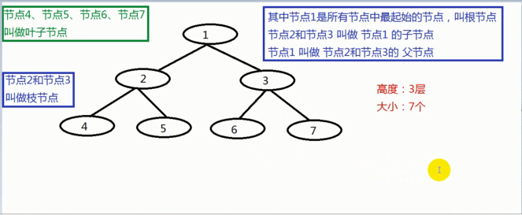

#####2. 什么是有序二叉树？
* 满足以下三个特征的叫作有序二叉树
  1. 左子树中的任意节点元素都小于根节点元素值；
  2. 右子树中的任意节点元素都大于根节点的元素值；
  3. 左子树和右子树内部也遵守上述规则；
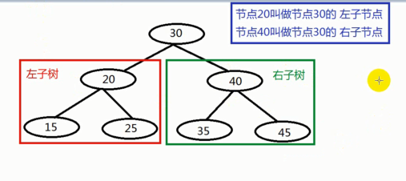 
>>TreeSet的底层是有序二叉树。 

#####3.满二叉树
* 在一棵二叉树中，所有的分支结点都在左子树和右子树，并且所有的叶子都在同一层上。
* 特点：
 1. 叶子只能在最下一层，出现在其它层就不能达到平衡了。
 2. 非叶子节点的度一定是2。
 3. 在同样深度的二叉树中，满二叉树的结点个数最多，叶子数最多。

#####4.完全二叉树
* 对一刻具有n个结点的二叉树按层编号，如果编号为i(1<=1<=n)的结点与同样深度的满二叉树中编号为i的结点在二叉树中位置完全相同  
* 特点：  
	1. 叶子节点出现在最下层和次下层  
	2. 最下层的叶子结点集中在树的左部  
	3. 倒数第二层若存在叶子结点，一定在右部连续位置  
	4. 如果结点度为1，则该结点只有左孩子，即没有右子树。  
	5. 同样结点数目的二叉树，完全二叉树深度最小  
>注：满二叉树一定是完全二叉树，但反过来不一定成立  

####5. 什么是平衡二叉树？
* 平衡二叉搜索树（Self-balancing binary search tree）又被称为AVL树（有别于AVL算法），且具有以下性质
  1. 它是一颗空树或者它左右两个子树的高度差的绝对值不超过1，并且左右两个子树都是一棵平衡二叉树。
  2. 若将二叉树节点的平衡因子BF定义为该节点的左子树的深度减去它的右子树的深度，则平衡二叉树上所有节点的平衡因子只可能为-1,0,1. 
     * -1   ： 表示左子树比右子树高  
	 * 1   : 表示右子树比左子树高  
	 * 0   ： 表示左子树和右子树等高 
  3. 只要二叉树上有一个节点的平衡因子的绝对值大于1，那么这颗平衡二叉树就失去了平衡。
<a href="https://www.jianshu.com/p/eaae838dee4c">参考资料1</a>  
<a href="https://www.imooc.com/article/73156">参考资料2</a>  
<a href="https://www.cnblogs.com/hello-shf/p/11352071.html">AVL原理及实现</a>

####6.什么是红黑树
* 红黑树（Red Black Tree） 是一种自平衡二叉查找树，是在计算机科学中用到的一种数据结构，典型的用途是实现关联数组。
* 红黑树的性质：
  1. 节点是红色或黑色。
  2. 根结点是黑色。
  3. 每个红色节点的两个子节点都是黑色。(从每个叶子到根的所有路径上不能有两个连续的红色节点)
  4. 从任一节点到其每个叶子的所有路径都包含相同数目的黑色节点。
  5. 每个叶子节点（NIL）是黑色。 [注意：这里叶子节点，是指为空(NIL或NULL)的叶子节点！
> 特性(5)中的叶子节点，是只为空(NIL或null)的节点。  
> 特性(4)，确保没有一条路径会比其他路径长出俩倍。因而，红黑树是相对接近平衡的二叉树。 
     
* 红黑树示意图：

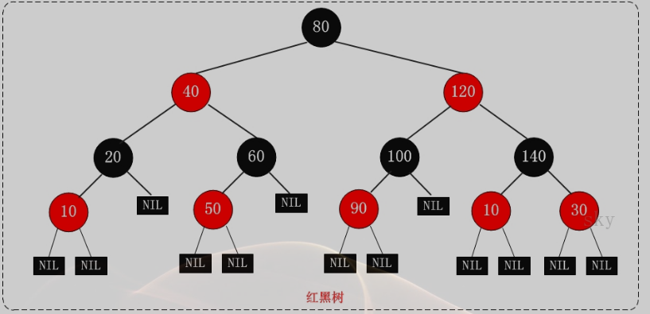

* 区分红黑树的左旋和右旋
* 对旋转的理解  
  为了保持红黑树的特性，必须要做两件事情：
  1. 使一些节点上升，使一些节点下降，帮助树平衡
  2. 保证不破坏二叉搜索树的特征

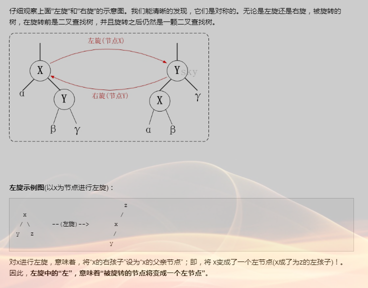
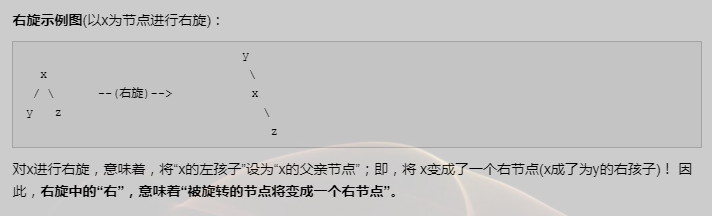
####7.什么是B树（B树即为B-树）
	数据库系统普遍采用B-/+Tree作为索引结构。eg:mysql的InnoDB引擎使用的是B+树。
* 概念  
 1. B树是一种自平衡树数据结构，英文名字叫做B-tree，中间的短线是英文连接符，只是翻译的时候将短线翻译成了减号。
 2. 全称Balance-tree(平衡多路查找树)，平衡的意思是左边和右边分布均匀。多路的意思是相对于二叉树而言的，二叉树就是二路查找树，查找时只有两条路，而B-tree有多条路，即父节点有多个子节点。
* 用途  
 使用B-tree结构可以显著减少定位记录时所经历的中间过程，从而加快存取速度。这个数据结构一般用于数据库的索引，综合效率较高。
* 阶的概念  
	对于一棵m阶B-tree，每个结点至多可以拥有m个子结点。
	即遍观整棵树，子节点最多的个数是m，那么这棵树就是m阶树。
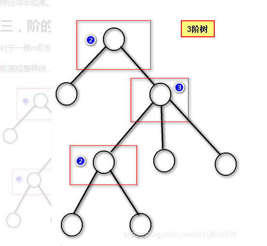
 
* 定义（B树是一种平衡的多分树，通常我们说m阶的B树），它必须满足如下条件： 
 1. 每个节点最多只有m个子节点。
 2. 每个非叶子节点（除了根）具有至少⌈ m/2⌉子节点。
 3. 如果根不是叶节点，则根至少有两个子节点。
 4. 具有k个子节点的非叶节点包含k-1个键。
 5. 所有叶子都出现在同一水平，没有任何信息（高度一致）。
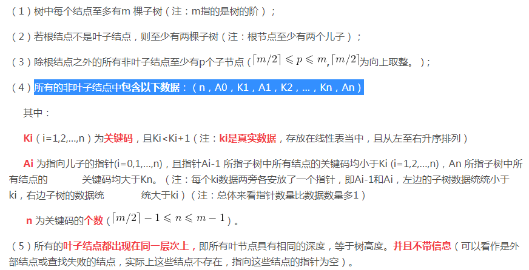

* <b>B-Tree的插入</b>
1.png)
2.png)
3.png)
####8. 什么是B+树
     B+树是一种树数据结构，通常用于数据库和操作系统的文件系统中。B+树的特点是能够保持数据稳定有序，其插入与修改拥有较稳定的对数时间复杂度。B+树元素自底向上插入，这与二叉树恰好相反。
* <b>B+树的特征:</b>  
	B+树是一个n叉树，每个节点通常有多个孩子，一颗B+树包含根节点、内部节点和叶子节点。B+ 树的特点是能够保持数据稳定有序，其插入与修改拥有较稳定的对数时间复杂度。
* <b>一个m阶的B树具有如下几个特征：</b>
	1. 根结点至少有两个子女。
	2. 每个中间节点都至少包含ceil(m / 2)个孩子，最多有m个孩子。
	3. 每一个叶子节点都包含k-1个元素，其中 m/2 <= k <= m。
	4. 所有的叶子结点都位于同一层。
	5. 每个节点中的元素从小到大排列，节点当中k-1个元素正好是k个孩子包含的元素的值域分划。
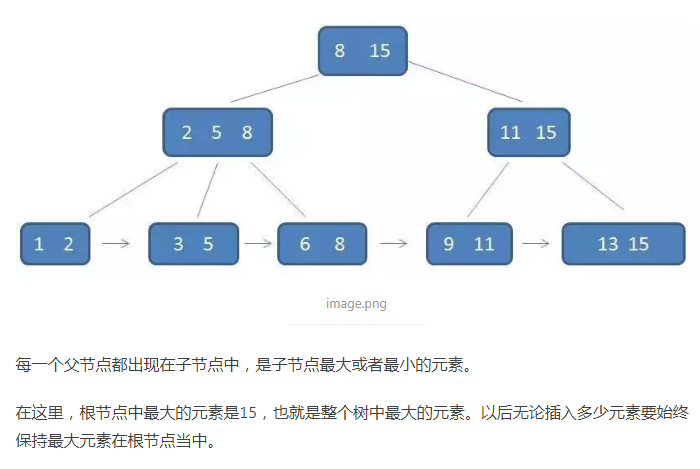
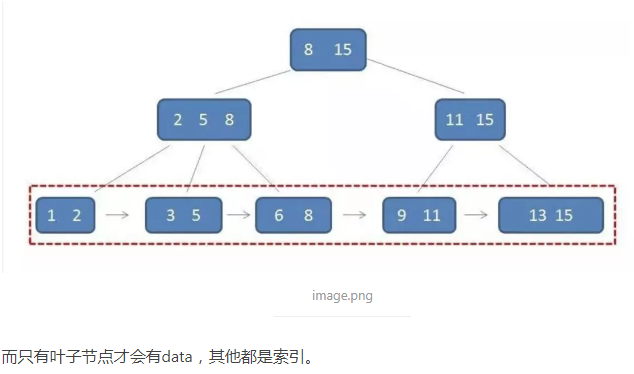
* <b>B+与B-树的区别</b>
	* 有k个子结点的结点必然有k个关键码；
	* 非叶结点仅具有索引作用，跟记录有关的信息均存放在叶结点中。
	* 树的所有叶结点构成一个有序链表，可以按照关键码排序的次序遍历全部记录。

#<a href="https://www.cnblogs.com/guohai-stronger/p/9225057.html">B树和B+树参考</a>
