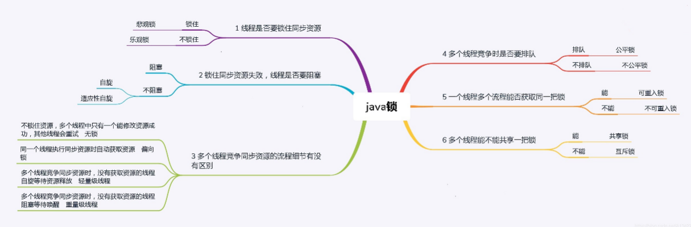

##线程
**11/28/2019 4:46:32 PM**

###基本概念
	程序 - 数据结构 + 算法，主要指放在硬盘上的可执行文件。
	进程 — 主要指运行在内存中的可执行文件。
	
	目前主流的操作系统都支持多进程，是为了让操作系统同事执行多个任务，进程是重量级的，新建进程对系统的资源消耗比较大，因此进程的数量比较局限。

	线程是进程内部的程序流，并且线程是 轻量级的，新建线程会共享所在进程的系统资源，因此主流的开发都采用多线程。
	多线程是采用时间片轮转法来保证线程的并发执行，所谓并发就是指宏观并行微观串行机制。

###线程的创建 ***
1. 线程的创建方式  
	* java,lang.Thread类主要用于描述线程，Java虚拟机允许应用程序执行多个线程，而线程的创建方式如下：  
		* a.自定义类继承Thread类并重写run方法，然后创建该类的对象调用start方法。  
		* b.自定义类使用Runnable接口并重写run方法，然后创建该类的对象作为实参来构造Thread类的对象，最后使用Thread类的对象调用start方法。
2. 相关方法的解析  
	Thread() - 使用无参方式构造对象  
	Thread(String name) - 根据参数指定的名称来构造对象    
	Thread(Runnable target) - 根据参数指定的接口引用来构造对象  
	Thread(String name，Runnable target) - 根据参数指定的接口引用和名称来构造对象。

	void run() - 若线程对象是采用Runnable对象构造的，调用run方法时最终调用Runnble接口引用所指向的run方法，否则调用该方法啥也不做。  
	void start() - 用于启动线程，Java虚拟机会自动调用该线程的run方法。
	
3. 原理分析
	* 执行main方法的线程叫做主线程，执行run方法的线程叫做子线程；
	* main方法是程序的入口，对于start方法调用之前的代码来说由主线程执行一次，当start方法调用成功后线程的个数由一个变成两个，新创建的线程去执行run方法的代码，主线程继续向下执行，两个线程各自独立运行互不影响。
	* 当run方法执行完毕后则子线程结束，当main方法执行完毕后主线程结束，两个线程的先后执行次序没有明确的规定，由系统的调度算法决定。
	
4. 两种方式的比较
	* 使用继承Thread类的方式代码比较简单，但Java语言中支持单继承，若该类继承了Thread类就无法继承其他类
	* 使用实现Runnable接口的方式代码比较复杂，但不影响改类继承其他类以及实现其他接口，在以后的开发中推荐使用该方式。（可提高代码的维护性，扩展性等）
###线程的编号和名称

###线程的主要状态
	新建状态 - 使用new关键字创建之后进入的状态
			- 此时线程并没有开始执行   
	就绪状态 - 调用start方法后进入的状态
			- 此时线程还是没有开始执行
	运行状态 - 使用线程调度器调用该线程后进入的状态
			- 此时线程开始执行
			- 当线程的时间片执行完毕后任务没有完成时回到就绪状态
	消亡状态 - 当线程的任务执行完成后进入的状态
			- 此时线程已经终止
	阻塞状态 - 当线程执行的过程中发生了阻塞事件进入的状态，如：sleep方法
			- 阻塞状态解除后进入就绪状态

###线程的优先级
* getPriority - 返回线程优先级  
* setPriority - 修改线程的优先级
优先级可查看API中的优先级常量
>>优先级越高的线程不一定先执行，但该线程获取到时间片的机会越多，也就是说越有可能先执行完毕。

###线程的常用方法***

对于新创建的线程来说。默认不是守护线程  
当JAVA程序中所有非守护线程结束后，守护线程会随之结束

###线程的同步机制***
1. 基本概念  
	当多个线程同时访问同一种共享资源时，可能会造成数据的覆盖等不一致问题，此时需要对多个线程之间进行通信和协调，改机制就叫线程的同步机制。

2. 解决方案  
	* 由程序结果可知：当两个线程同时对同一个账户取款时，导致最终的账户余额不合理。  
	* 引发的原因：第一个线程还没有取款结束，第二个线程就已经开始取款  
	* 解决方案：让第一个线程取款结束后再让第二个线程进行取款，将线程的并发操作改为串行操作。  
>注意事项：为了提高代码的并发效率，应该尽量减少锁定的范围。  

3. 实现方式  
	在JAVA语言中提供了一种内置的锁机制来保证代码执行的原子性，需要使用synchronized关键字加以修饰。
* 具体方式：  
	* 使用同步代码块的方式实现部分代码的锁定，格式如下 :  
		synchornized(类类型的引用){   
			编写所有需要锁定的代码；  
		}
	* 使用同步方法的方式实现所有代码的锁定，直接使用synchornized关键字来修饰整个代码即可，该方式等价于：  
		synchornized(this){整个方法体的代码}

4. 死锁的概念

线程一执行的代码： 持有对象锁的a等待对象 锁b

		public void run(){
			synchronized(a){
				synchornized(b){
					...
				}
			}
		}

线程二执行的代码： 持有对象锁的b等待对象锁a

		public void run(){
			synchronized(b){
				synchornized(a){
					...
				}
			}
		}

>注意：在以后的开发中尽量不要使用同步代码块的嵌套结构来避免死锁的发生。

###Object类中常用的方法

	void wait() - 用于使得其他线程进入等待状态，知道其他线程调用notify()或notifyAll()方法。

	void wait(long timeout) - 用于进入等待状态，直到其他线程调用方法或参数指定的毫秒数已经过去为止。

	void notify() - 用于唤醒等待的单个线程。(唤醒等待线程中的任意一个线程)

###线程池原理
 	* 在服务器编程模型的原理中，每个客户端连接用一个单独的线程为之服务，当客户端的会话结束时，线程也就结束了，即每来一个客户端连接，服务器就要创建一个新的线程。
	* 如果访问服务器的客户端很多，那么服务器要不断地创建和销毁线程，这将严重影响服务器的性能。
	* 线程池的概念：首先创建一些线程，他们的集合成为线程池，当服务器接收到一个客户请求后，就从线程池中取出一个空闲的线程为之服务，服务完后不关闭该线程，而是将该线程还回到线程池中。
	* 在线程池的编程模式下，任务是提交给整个线程池，而不是直接交给某个线程，线程池在拿到任务后，它就在内部找有无空闲的线程，再把任务交给内部某个空闲的线程。
	* 任务提交给整个线程池。
	* 一个线程同时只能执行一个任务，但可以同时向一个线程池提交多个任务。

###java.util.concurrent(线程并发包 )

* ExecutorService

###多线程的并发解决方案

问题描述：多个线程操作同一个资源的情况下，线程不安全，数据紊乱。  
* synchornized和Object(wait,notify,notifyAll)配合使用  
* Lock和Condition配合使用  
* LockSupport  
-----》1. 描述：用来创建锁和其他同步工具类的基本线程阻塞原语。LockSupport很类似于二元信号量(只有1个许可证可供使用)，如果这个许可还没有被占用，当前线程获取许可并继续执行；如果许可已经被占用，当前线程阻塞，等待获取许可。  
-----》2. 常用方法：

		static void park() - 为了线程调度，禁用当前线程，除非许可可用。
		static void park(Object blocker)  - 为了线程调度，在许可可用之前禁用当前线程。 
		static void unpark(Thread thread)  - 如果给定线程的许可尚不可用，则使其可用。

>没个对象都有一个锁，sleep不会释放锁  
>sleep:模拟网络延时，放大问题的发生性
 
###多线程中常见的锁分类

* 公平锁和非公平锁  
	1. 公平锁：是指多个线程按照申请锁的顺序来获取锁
	2. 非公平锁：是指多个线程获取锁的顺序并不是按照申请锁的顺序，有可能后申请的线程比先申请的线程优先获锁。
* 悲观锁和乐观锁
	1. 悲观锁：悲观锁认为自己在使用数据的时候，一定有别的线程来修改数据，在获取数据的时候会先加锁，确保数据不会被别的线程修改。
		* 锁实现：关键字synchronized、接口Lock的实现类
		* 使用的场景：写操作较多，先加锁可以保证写操作是数据正确
	2. 乐观锁：乐观锁认为自己在使用数据的时候不会有其他的线程修改数据，所以不会添加锁，只是在更新数据的时候去判断之前有没有别的线程更新了这个数据
		* 锁实现：CAS算法 [(相关链接)](https://blog.csdn.net/q5706503/article/details/84558343)
		* 使用场景：读操作较多，不加锁的特点能够使其读操作的性能大幅提升

* [其他相关锁的定义及解释](https://blog.csdn.net/A1342772/article/details/89853412)
