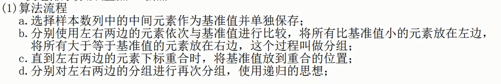

###任务七
####一、冒泡排序算法

[冒泡排序参考](https://www.cnblogs.com/bigdata-stone/p/10464243.html)

    //自定义成员方法实现冒泡排序算法
	public static void bubble(int[] arr){
		//1.使用外层for循环用于控制比较的轮数
		for(int i = 1; i < arr.length; i++){
			//声明boolean类型的变量作为本轮是否发生交换的标志位
			boolean flag = true;
			//2.使用内层for循环用于控制每轮中比较的次数
			for(int j = 0; j < arr.length-i; j++){
				//3.若第一个元素比第二个元素大，则交换两个元素的位置
				if(arr[j] > arr[j+1]){
					int temp = arr[j];
					arr[j] = arr[j+1];
					arr[j+1] = temp;
					flag = false;
				}
			}
			//若代码执行到这个位置后flag的数值还是true，则证明本轮比较没有发生交换
			if(flag){
				break; //省略剩下的比较轮数
			}
		}
	}
####二、快速排序算法
* 快速排序是对冒泡排序的一种改进
* 通过一趟排序，将要排序的数据分割成独立的两部分，其中一部分的所有数据都比另外一部分的所有数据都要小，然后再按此方法对这两部分数据分别进行快速排序，整个排序过程可以递归进行，以此达到整个数据变成有序序列。
####（1）、排序流程
	1. 首先设定一个分界值，通过该分界值将数组分成左右两部分。
	2. 将大于或等于分界值的数据集中到数组右边，小于分界值的数据集中到数组的左边。此时，左边部分中各元素都小于或等于分界值，而右边部分中各元素都大于或等于分界值。
	3. 然后，左边和右边的数据可以独立排序。对于左侧的数组数据，又可以取一个分界值，将该部分数据分成左右两部分，同样在左边放置较小值，右边放置较大值。右侧的数组数据也可以做类似处理。
	4. 重复上述过程，可以看出，这是一个递归定义。通过递归将左侧部分排好序后，再递归排好右侧部分的顺序。当左、右两个部分各数据排序完成后，整个数组的排序也就完成了。

####（2）、排序步骤
1. 原理
	* 设要排序的数组是A[0]……A[N-1]，首先任意选取一个数据（通常选用数组的第一个数）作为关键数据，然后将所有比它小的数都放到它左边，所有比它大的数都放到它右边，这个过程称为一趟快速排序。值得注意的是，快速排序不是一种稳定的排序算法，也就是说，多个相同的值的相对位置也许会在算法结束时产生变动。
	* 一趟快速排序的算法是：
	 *  设置两个变量i、j，排序开始的时候：i=0，j=N-1；
	 *  以第一个数组元素作为关键数据，赋值给key，即key=A[0]；
	 *  从j开始向前搜索，即由后开始向前搜索(j--)，找到第一个小于key的值A[j]，将A[j]和A[i]的值交换；
	 *  从i开始向后搜索，即由前开始向后搜索(i++)，找到第一个大于key的A[i]，将A[i]和A[j]的值交换；
	 *  重复第3、4步，直到i=j； (3,4步中，没找到符合条件的值，即3中A[j]不小于key,4中A[i]不大于key的时候改变j、i的值，使得j=j-1，i=i+1，直至找到为止。找到符合条件的值，进行交换的时候i， j指针位置不变。另外，i==j这一过程一定正好是i+或j-完成的时候，此时令循环结束）。
***
	//自定义成员方法实现快速排序算法
	public static void quick(int[] arr, int left, int right){
		//1.计算中间元素的下标并使用变量记录
		int p = (left+right) / 2;
		//2.选择中间元素作为基准值并单独保存起来
		int pivot = arr[p];
		//3.分别使用左右两边的元素依次与基准值比较大小，将所有小于基准值的元素放在左边，
		//  将所有大于等于基准值的元素放在基准值的右边
		//给左右两边的元素下标指定替身，为了递归方便
		int i = left;
		int j = right;
		for( ; i < j; ){
			//若左边有元素并且左边的元素小于基准值，则使用下一个元素与基准值比较
			while(i < p && arr[i] < pivot){
				i++;
			}
			//直到左边有元素但左边的元素不再小于基准值时，则将左边的元素赋值给p指向的
			//位置，p指向该元素原来的位置
			if(i < p){
				arr[p] = arr[i];
				p = i;
			}
			//若右边有元素并且右边的元素大于等于基准值，则使用下一个元素与基准值比较
			while(p < j && arr[j] >= pivot){
				j--;
			}
			//直到右边有元素但右边的元素不再大于等于基准值时，则将右边的元素赋值到p指向
			//的位置，p指向该元素原来的位置
			if(p < j){
				arr[p] = arr[j];
				p = j;
			}
		}
		//4.直到左右两边的元素下标重合时，将基准值放到重合的位置
		arr[p] = pivot;
		//5.分别对左右两边的分组进行再次分组，使用递归的思想
		//左右两边的分组分别至少有2个元素才需要递归
		if(p - left > 1){
			quick(arr, left, p-1);
		}
		if(right - p > 1){
			quick(arr, p+1, right);
		}
	}
***
#####快速排序API中的方法
Arrays.sort();