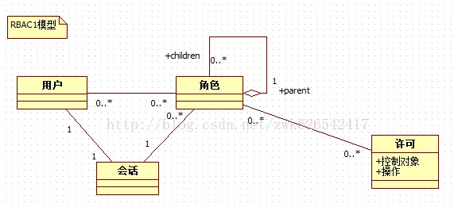
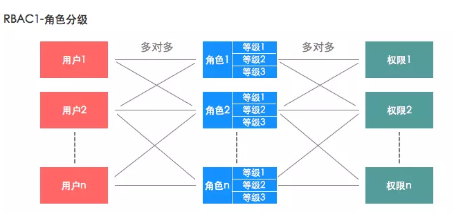

##任务：设计一套权限管理系统的数据库结构。
**12/4/2019 7:37:09 PM**

###权限管理系统定义
* 权限管理系统是一个几乎所有后台系统都会涉及的一个重要组成部分，主要目的是对整个后台管理系统进行权限控制，而针对的对象是员工，避免因权限控制缺失或操作不当引发的风险问题，如操作错误，数据泄露等问题。
* 目前权限管理设计使用最广泛的是一个账户对应多个角色，每个对象对应相应的权限集(RBAC模型)这种模型基本可以应对所有的问题，且通过角色可以实现灵活且多样的的权限操作需求。

>>>关键名词：用户，角色，权限

#####1、账号的定义
* 每个员工想要进入系统肯定都会有一个账号，而这个账号就是一把钥匙。
* 我们通过控制账号所具备的权限，进而控制这个员工的授权范围。
#####2、角色的定义
* 角色管理是确定角色具备哪些权限的一个过程，他是一个集合的概念，是众多最小权限颗粒的组成。
* 作为桥梁的作用，把权限给这个角色，再把角色给账号，从而实现账号的权限。
* 作用：可以使一个账户具备多种角色。
#####3、权限的定义
>权限分为三种：页面权限，数据权限，操作权限  

	* 页面权限
		1. 控制页面的可见性
		2. 优缺点
			实现起来比较简单，但比较古板，控制的权限不精细，难以在页面上对权限进行更下一层级的划分。
	* 操作权限
		控制在页面上可操作哪些按妞
	* 数据权限
		控制数据的可见性

###RBAC模型
#####简介
* RBAC是Role-BasedAss Control的英文缩写，意思是基于角色的访问控制。RBAC认为权限实际上是who、what、how的问题。在RBAC模型中，who、what、how构成了访问权限三元组，也就是“Who对What(Which)进行How的操作，也就是“主体”对“客体”的操作，其中who——是权限的拥有者或主体（如：User、Role），what——是资源或对象（Resource、Class)
* RBAC是一种分析模型，主要分为：基本模型RBAC0（Core RBAC）、角色分层模型RBAC1（Hierarchal RBAC）、角色限制模型RBAC2（Constraint RBAC）和统一模型RBAC3（Combines RBAC）。

	**1. RBAC0**  
		RBAC0是RBAC的核心，RBAC1、RBAC2、RBAC3都是先后在RBAC0上的扩展。RBAC0定义了能构成RBAC控制系统的最小的元素集合，RBAC0由四部分构成：  
			a、用户(User)  
			b、角色(Role)  
			c、会话(Session)  
			d、许可(Pemission),其中许可又包括“操作”和“控制对象”其中许可被赋予角色，而不是用户，当一个角色被指定给一个用户时，此用户就拥有了该角色所包含的许可。会话是动态的概念，用户必须通过会话才可以设置角色，是用户与激活的角色之间的映射关系。
		
		

	>>用户与角色是多对多的关系；角色和许可也是多对多的关系；用户与会话是一对一关系；会话与角色是一对多关系；

	**2. RBAC1**   
		RBAC1是RBAC角色的分层模型，RBAC1建立在RBAC0基础之上，在角色中引入了继承的概念，有了继承那么角色就有了上下级或者等级关系
		
		

	**3. RBAC2**   
		RBAC2，它是RBAC的约束模型，RBAC2也是建立的RBAC0的基础之上的，在RBAC0基础上假如了约束的概念，主要引入了静态职责分离SSD(Static Separation of Duty)和动态职责分离DSD(Dynamic Separation of Duty)。  
		SSD是用户和角色的指派阶段加入的，主要是对用户和角色有如下约束:  
			a、互斥角色：同一个用户在两个互斥角色中只能选择一个  
			b、基数约束：一个用户拥有的角色是有限的，一个角色拥有的许可也是有限的  
			c、先决条件约束：用户想要获得高级角色，首先必须拥有低级角色  
		DSD是会话和角色之间的约束，可以动态的约束用户拥有的角色，如一个用户可以拥有两个角色，但是运行时只能激活一个角色。 
		

	**4. RBAC3**  
		RBAC3，它是RBAC1与RBAC2合集，所以RBAC3是既有角色分层又有约束的一种模型
		      
		以上就是RBAC模型的四种设计思想，现在我们用的权限模型都是在RBAC模型的基础上根据自己的业务进行组合和改进。

###E-R模型（E-R图）
#####简介
	E-R模型全称为实体联系模型，实体关系模型或实体联系模式图（ERD）（Entity-relationship model）,是概念数据模型的高层描述所使用的数据模型和模型图。
	常用于信息系统设计中，例：在概念结构设计阶段用来描述信息需求和/或要存储在数据库中的信息的类型。
#####模型结构
* 分类  
	E-R模型的构成成分是实体类、属性、联系集。表示方式如下：  
	1. 实体集用矩形框表示，矩形框内写入实体名
	2. 实体的属性用椭圆框表示，框内写属性名，并用无向边与实体集相连
	3. 实体间的联系用菱形框表示，联系以适当的含义命名，名字写在菱形框中，用无向边连线将参与联系的实体矩形框分别与菱形框相连，并在连线上标明联系的类型，即1-1、1-N、M-N
* 原则  
	从数据需求分析中分析出系统的实体属性图，需要遵循三范式原则，对实体之间的依赖关系进行了整合，得出系统E-R图。
>>菱形表示实体之间的关系，用矩形表示实体，用无向直线把菱形与有关实体连接，在直线上标明联系的类型。用椭圆表示实体的属性，并用无向直线把实体与属性联系起来。  

>[三范式原则相关概念与解释](https://blog.csdn.net/weixin_30835933/article/details/96703405)

#####[MySQL的sql执行计划](http://www.wltbk.com/An/MySQL%E7%9A%84SQL%E6%89%A7%E8%A1%8C%E8%AE%A1%E5%88%92%20-%20%E7%AE%80%E4%B9%A6.html)